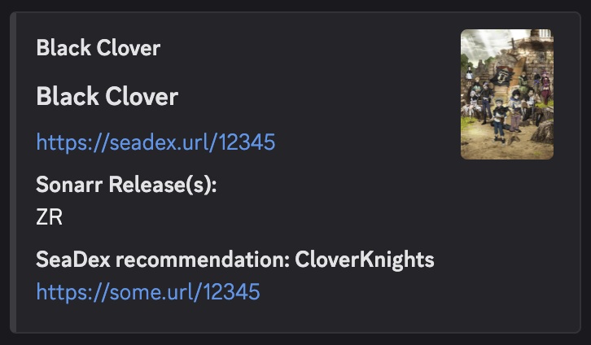

# SeaDexArr

[](https://pypi.org/pypi/seadexarr/)
[](https://pypi.org/pypi/seadexarr/)
[](https://github.com/bbtufty/seadexarr/actions)
[](LICENSE)



SeaDexArr is designed as a tool to ensure that you have Anime releases on the Arr apps that match with the best 
releases tagged on SeaDex. 

SeaDexArr currently has support for Sonarr. It works by scanning through series tagged as type "Anime", matching these 
up via the TVDB ID to AniList mappings via the Kometa Anime Mappings (https://github.com/Kometa-Team/Anime-IDs), 
AniDB mappings (https://github.com/Anime-Lists/anime-lists), and ultimately finding releases in the SeaDex database 

SeaDexArr will then do some cuts to select a "best" release, which can be pushed to Discord via a bot, and added
automatically to a torrent client. This should make it significantly more hands-free to keep the best Anime releases 
out there.

## Installation

SeaDexArr can be installed via pip:

```
pip install seadexarr
```

Or the cutting edge via GitHub:

```
git clone https://github.com/bbtufty/seadexarr.git
cd seadexarr
pip install -e .
```

## Usage

To run SeaDexArr for Sonarr, the Python code is pretty short:

```
from seadexarr import SeaDexSonarr

sonarr_url = "your-sonarr-url:8989"
sonarr_api_key = "abcdefg12345"

sds = SeaDexSonarr(sonarr_url=sonarr_url, 
                   sonarr_api_key=sonarr_api_key
                   )
sds.run()
```

If you want to use Discord notifications (recommended), then set up a webhook following 
[this guide](https://support.discord.com/hc/en-us/articles/228383668-Intro-to-Webhooks) and add the URL into the call:

```
from seadex_sonarr import SeaDexSonarr

sonarr_url = "your-sonarr-url:8989"
sonarr_api_key = "abcdefg12345"
discord_url = "https://discord.com/api/webhooks/abcde12345"

sds = SeaDexSonarr(sonarr_url=sonarr_url, 
                   sonarr_api_key=sonarr_api_key,
                   discord_url=discord_url,
                   )
sds.run()
```

## Adding torrents to client

SeaDexArr has support for adding torrents automatically (current only for Nyaa torrents, and qBittorrent). To do
this, add qBittorrent connection info, and ideally the Sonarr torrent category to the function call:

```
...

qbit_info = {
    "host": "http://localhost:8080",
    "username": "username",
    "password": "password",
}
sonarr_category = "sonarr"

sds = SeaDexSonarr(sonarr_url=sonarr_url, 
                   sonarr_api_key=sonarr_api_key,
                   qbit_info=qbit_info,
                   torrent_category=torrent_category,
                   )
sds.run()
```

## Advanced Settings

There are a number of switches you can use to filter down what SeaDex-Sonarr returns as the "best" option for you. These 
are:

- `public_only` (defaults to True), will only return results from public trackers
- `prefer_dual_audio` (defaults to True) will prefer results tagged as dual audio, if any exist
- `want_best` (defaults to True) will prefer results tagged as best, if any exist

There are also some torrent-related settings:

- `sonarr_category` should be set to your Sonarr import category, if you have one
- `max_torrents_to_add` can be used to limit the number of torrents you add in one run. Defaults to None, which 
   will just add everything it finds

And some more general settings:

- `interactive` (defaults to False). If True, will enable interactive mode, which when multiple torrent options are
   found, will ask for input to choose one. Otherwise, will just grab everything
- `log_level` (defaults to INFO), controls the level of logging. Can be WARNING, INFO, or DEBUG

## Roadmap

- Support for Radarr
- Currently, some episodes (particularly movies or OVAs) can be missed. This should be improved in the future by using
  more robust mapping between AniDB entries and AniList entries
- Support for other torrent clients
- Support for torrents on sites other than Nyaa
